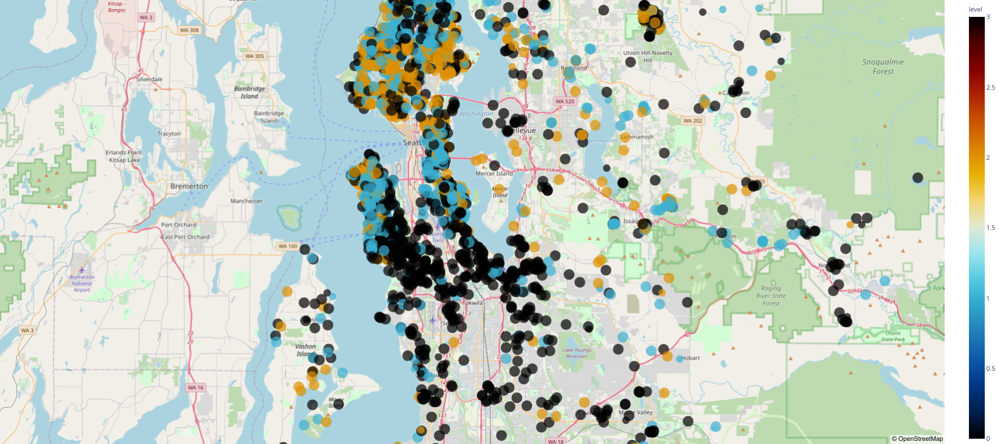

# Analysis of house prices in washington

This analysis was performed during class 5 of the @meigarom python course.
The company's CEO asked for an analysis on the properties and that he could see this data on some maps. free.:+1:

### Where to find me:

<a href="https://www.linkedin.com/in/clenio-oliveira"></img></a> [LinkedIn](https://www.linkedin.com/in/clenio-oliveira)  

<a href="https://www.instagram.com/afonso.clenio/"></img></a> [Instagram](https://www.instagram.com/afonso.clenio/) 

<a href="https://twitter.com/clenioafonso"></img></a> [twitter](https://twitter.com/clenioafonso)

